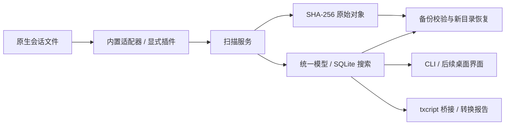

# Agent Session Manager

[](https://github.com/222222222l/Agent-Session-Manager/actions/workflows/check.yml)

本地 Agent 会话管理核心与 CLI 原型：统一导入、搜索、查看、转换和备份分散的会话文件，保留原始字节与解析诊断。已下载并分析 CC Switch、CCHistory、txcript，选择性整合其发现规则、解析／续接规则和转换引擎。

当前支持 Claude Code JSONL、Codex rollout JSONL、Gemini 旧 JSON 和 Simple JSON。新产品可以通过独立适配器接入，无需给核心添加 Agent 枚举或改数据库。当前没有桌面界面；Cursor／其他 IDE 数据库、Gemini 新 JSONL 和原生恢复尚未实现。

## 当前仓库状态

**版本：0.1.0；阶段：初步整合／Alpha 核心原型。** 已具备从显式导入到管理库恢复的可运行流程，尚非可替代所有 Agent／IDE 原生历史的完整桌面应用。当前通过源码运行，没有安装包，`package.json` 的 `private: true` 用于阻止误发布 npm 包。

| 能力 | 当前状态 |
| --- | --- |
| 来源发现、只读扫描 | 已实现；发现候选不会自动导入 |
| 会话归一化、列表、全文搜索、查看 | 已实现；SQLite FTS5，中英文搜索覆盖集成测试 |
| 原始文件保存、修订保留、来源隔离 | 已实现；SHA-256 对象存储，未知记录仍保留在原文中 |
| 跨 Agent 转换 | 已实现文件导出和损失报告；目标为 Simple、Claude Code、Codex |
| 续接／调度 | 当前只输出原 CLI 的 executable／args／cwd；无进程启动、任务队列或并发调度 |
| 备份、校验、恢复 | 已实现管理库及已捕获文件的备份，恢复到新目录 |
| 新格式扩展 | Adapter API v1、显式 JS 插件、可运行示例已实现 |
| 桌面 GUI、原生目录回写、云同步 | 尚未实现 |

| 来源 | 当前读取范围 | 原 CLI 续接计划 |
| --- | --- | --- |
| Claude Code | 含 `sessionId` 的 JSONL | `claude --resume ID` |
| Codex | 含 `session_meta` 的 rollout JSONL | `codex resume ID` |
| Gemini CLI | 旧 JSON；新 JSONL 捕获原文并报告不支持 | `gemini --resume ID` |
| Simple | 含显式 ID／时间戳的交换 JSON | 无 |
| 自定义 Agent | 通过可信插件接入；提供 Notebook 格式示例 | 由适配器声明 |
| Cursor／VS Code 等 IDE | 尚未实现数据库读取 | 尚未实现 |

本地验收：**21 项集成测试通过**，上游来源校验通过，合成数据演示完成导入、搜索、转换、备份、校验与恢复。测试使用真实 txcript WASM，但不代表各 Agent 对导出文件的原生续接均已验收。远端 CI 的最新状态见上方徽章与 [Actions](https://github.com/222222222l/Agent-Session-Manager/actions)。

## 快速运行

需要 Node.js 22.16+（22 系列）或 24+。依赖版本由 `package-lock.json` 锁定。

```bash
git clone https://github.com/222222222l/Agent-Session-Manager.git
cd Agent-Session-Manager
npm ci --ignore-scripts
npm test
npm run upstream:verify
npm run demo
```

演示只生成合成数据，在 `.demo/run-*` 中完成导入 → 搜索 → Codex 格式转换 → 备份 → 校验 → 恢复，不读取个人会话。`npm test` 会先构建；单独构建使用 `npm run build`。

本地已在 Linux／Node 22.22.3 实际验证。仓库配置 Windows、macOS、Linux × Node 22／24 CI；各平台自动化结果以 Actions 为准，不等于真实 IDE 集成已验收。Node 22 可能在 stderr 显示 SQLite 实验性提示。

## 使用 CLI

业务结果为 JSON。默认管理库为当前目录的 `.asm`；建议显式指定 `--store`。路径中的空格需要引号，Windows 可使用 `C:/Users/...`。扫描源目录与管理库目录不能互相包含。

```bash
npm run asm -- adapters
npm run asm -- discover
npm run asm -- scan --adapter claude_code --source laptop-claude --root /absolute/path/to/claude/projects --store /absolute/path/to/asm-store
npm run asm -- list --query "缓存" --store /absolute/path/to/asm-store
npm run asm -- show --id SESSION_ID --store /absolute/path/to/asm-store
npm run asm -- resume --id SESSION_ID --cwd /absolute/path/to/project --store /absolute/path/to/asm-store
npm run asm -- export --id SESSION_ID --target codex --out /absolute/path/to/new-export --store /absolute/path/to/asm-store
npm run asm -- backup --out /absolute/path/to/new-backup --store /absolute/path/to/asm-store
npm run asm -- verify-backup --dir /absolute/path/to/new-backup
npm run asm -- restore --dir /absolute/path/to/new-backup --out /absolute/path/to/new-restored-store
```

`SESSION_ID` 使用 `list` 返回的管理库 `id`。`discover` 只列候选目录；`scan` 才导入指定来源。不同机器／Profile 使用不同 `--source`，同一来源 ID 不允许换绑目录。扫描有解析错误时退出码为 2，原始捕获仍会保留；命令级错误退出码为 1。

`resume` 输出 executable／args／cwd 计划，不启动 Agent。`export` 输出 `transcript.txt` 与包含损失说明的 `report.json`，不是可保证原生续接的安装包。`restore` 恢复到新的管理库，拒绝覆盖现有目录，不回写原 Agent。

## 扩展与维护

当前技术栈为 **TypeScript + Node.js + SQLite（`node:sqlite` / FTS5）+ txcript WASM**。适配器负责厂商格式，核心负责统一模型、证据与管理操作，CLI 调用同一服务接口。前期计划中的 Tauri／Rust 桌面端尚未引入。



运行一个采用全新保存格式的插件：

```bash
npm run asm -- adapters --plugin examples/notebook-adapter.mjs
npm run asm -- scan --plugin examples/notebook-adapter.mjs --adapter example.notebook --source notebook-local --root /absolute/path/to/notebook-sessions --store /absolute/path/to/asm-store
```

插件是显式加载的可信 JavaScript，接口见 [示例](examples/notebook-adapter.mjs) 与 [维护指南](docs/05-adapters-and-upgrades.md)。Adapter API、适配器版本、规范模型与备份版本分别管理；txcript 被桥接层隔离，原始证据不依赖其转换结果。

| 目录 | 用途 |
| --- | --- |
| `src/` | 统一模型、适配器、管理服务、SQLite 索引、备份和 CLI |
| `vendor/` | 精选上游代码、移植代码与许可证 |
| `upstream/` | 本地参考 checkout；不随本仓库上传，需用 fetch 命令获取 |
| `test/`、`examples/` | 集成测试与新格式插件 |
| `docs/` | 项目评估、存储调研、开发计划和实际整合说明 |

`npm run upstream:fetch` 可按 [锁定清单](upstreams.lock.json) 下载缺失的参考仓库；运行不依赖这些 checkout。`npm run upstream:verify` 校验已保存的选取文件、许可证、已存在 checkout 的提交及 txcript 安装版本。来源和授权见 [第三方声明](THIRD_PARTY_NOTICES.md)。

## 上游项目与引用

本项目选择性复用以下项目的代码与能力，并维护自己的模型和数据层；不是三套完整应用的合并发行版，也不代表上游官方项目。

| 项目 | 本项目实际使用的部分 | 固定源码版本 | 上游许可证 |
| --- | --- | --- | --- |
| [CC Switch](https://github.com/farion1231/cc-switch) | Gemini JSON 消息读取、时间／标题处理移植；CLI 续接参数规则 | [`793e67d`](https://github.com/farion1231/cc-switch/tree/793e67d9b3210eb527e7d36f2c866a56fae9dec7) | [MIT](vendor/cc-switch/LICENSE) |
| [CCHistory](https://github.com/aaaAlexanderaaa/cchistory) | Claude Code、Codex、Gemini 的三个发现／文件匹配模块，原样保留；本地兼容类型另写 | [`36d209e`](https://github.com/aaaAlexanderaaa/cchistory/tree/36d209ec878020d80861884a07dfc8217be4461a) | [MIT](vendor/cchistory/LICENSE) |
| [txcript](https://github.com/skillsynchq/txcript) | 实际调用 npm `txcript@0.14.4` 的 WASM `toCommon`／`fromCommon`，经独立桥接层适配 | [`8cd3b0e`](https://github.com/skillsynchq/txcript/tree/8cd3b0e63f797b1531a14197f41a0e9eeedec8c6)（源码参考） | [Apache-2.0](vendor/txcript/LICENSE) |

txcript 的源码参考提交与 npm 发布包不是同一个版本标识；运行能力以锁定的 `0.14.4` 包和测试为准。完整提交、原文件路径、选取文件哈希和运行包完整性信息保存在 [upstreams.lock.json](upstreams.lock.json)，npm 依赖解析结果见 [package-lock.json](package-lock.json)。

CC Switch 的移植增加了诊断、未知记录保留和参数数组；未引入其配置切换、源文件删除及完整桌面层。CCHistory 的大型领域模型与完整存储层未引入。变更说明和版权信息见 [THIRD_PARTY_NOTICES.md](THIRD_PARTY_NOTICES.md)。原始调研文档也附有各 Agent 官方资料和其他候选项目的链接。

**许可证状态：**选取的第三方代码保留各自许可证与版权声明；本项目新增代码目前尚未指定统一开源许可证。公开托管不表示这些新增代码已按 MIT 或 Apache-2.0 授权。

## 当前边界

- 源文件只读；原文按 SHA-256 存储，派生索引可与原文核对。不同来源同名会话隔离，内容修订保留，源端删除不会删除归档。
- 备份覆盖已捕获文件和管理库元数据，不额外收集外部附件、项目代码、账号配置或未捕获的 IDE 状态。会话原文本身可能含敏感内容；校验用于发现损坏，没有加密和签名认证。
- 当前是有界整文件重扫：单文件 64 MiB，单次最多检查 10,000 文件，目录深度 32。后台监听、多文件会话、SQLite 一致性快照和自动重建等待后续实现。
- 当前测试使用合成会话，未对真实个人会话执行迁移；跨 Agent 转换可能丢失工具、检查点、推理及厂商私有状态，查看导出报告后再使用。

## 文档

| 文档 | 内容 |
| --- | --- |
| [已有项目评估与推荐](docs/01-existing-projects.md) | GitHub 项目对比、推荐组合、成熟度、采用与自研的决策条件 |
| [会话存储与读取调研](docs/02-session-storage.md) | CLI／IDE 存储矩阵、读取和续接接口、格式变化、适配边界 |
| [开发计划](docs/03-development-plan.md) | 条件性立项方案、推荐技术栈、架构、里程碑、主要难点和验收 |
| [GitHub 元数据快照](docs/github-evidence.json) | 查询时的关注度、仓库活动、许可证标识及已取得的提交／版本 |
| [实际整合契约](docs/04-integration-contract.md) | 本轮复用范围及 TypeScript／Node 技术选择 |
| [适配器与升级指南](docs/05-adapters-and-upgrades.md) | 模块边界、数据语义、扩展和验收 |

调研与初步整合日期：2026-10-03。实现现状以整合契约和维护指南为准；初始计划中的桌面功能及性能指标仍是未来目标。

## 后续开发顺序

1. 补齐 Gemini JSONL 适配和格式版本样本，扩展真实产品导出文件的兼容测试。
2. 增加 Cursor／IDE SQLite 一致性捕获、多文件会话及附件清单。
3. 完成索引重建、项目路径映射、分页／后台索引和升级迁移。
4. 接入桌面界面，逐项验证原生续接／恢复，再扩展进程调度和同步能力。

贡献格式适配时，请提供已脱敏的最小样本、产品版本、预期语义和测试；不要提交真实会话、令牌、账号配置或本地管理库。新增适配器与升级步骤见 [维护指南](docs/05-adapters-and-upgrades.md)。
