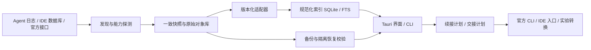

# 跨平台 Agent 会话管理系统开发计划

日期：2026-10-03。状态：调研后建议方案，尚未实现或通过产品验收。

关联：[现有项目评估](01-existing-projects.md)、[存储与读取调研](02-session-storage.md)。

## 1. 立项建议和范围

**推荐先用现有项目完成一次采用验证；若仍存在必需能力缺口，再开发统一管理层。** 不重做供应商／Token 路由，不从零实现所有私有格式转换器。

产品定位：面向同时使用多个 Agent／IDE、在多个项目和设备间工作的个人开发者，把分散会话变成可查找、可保存、可验证恢复、可交接的本地资产。

本计划暂定 Windows、macOS、Linux 桌面为目标；首版单用户、本地优先；“调度”先实现工具选择、工作目录定位和上下文交接。远端执行调度另列后续阶段，不把终端标签页管理包装成历史迁移。

成功的典型流程：用户搜索曾经讨论过的错误 → 找到来自 Claude／Codex／Cursor 的历史 → 查看来源与完整性 → 备份选定项目 → 在隔离目录校验恢复 → 在匹配项目中用原 Agent 继续；需要换工具时生成新的交接会话并明确列出信息损失。

## 2. 复用策略与决策门

| 方案 | 优点 | 代价／局限 | 选择条件 |
| --- | --- | --- | --- |
| 采用 CC Switch／CCHistory／txcript 组合 | 最快落地，少维护适配代码 | 多入口，备份与恢复需自行验证 | 接受 CLI／Web 组合时优先 |
| 扩展已有项目 | 可沿用成熟界面或归档模型 | 受现有架构和上游方向影响 | 缺口主要是少量来源或入口 |
| 新建 Tauri 管理器，复用转换组件 | 能统一数据保留、恢复和桌面流程 | 三平台测试与适配维护成本最高 | 单应用流程和可靠恢复是刚性要求 |

P0 用实际样本比较现有工具。如果 [采用条件](01-existing-projects.md) 均满足，项目交付切换为安装配置说明和恢复操作手册，取消应用开发。不以“界面能做得更漂亮”作为自研充分理由。

如果自研，优先评估 txcript 作为格式转换／部分读取组件。自身仍保留原始快照和版本信息：不能让一次有损转换成为唯一存档。CCHistory 可作为外部归档／导出集成候选，不在首版同时维护两套权威管理库。CASS 当前带额外许可证限制，不进入默认依赖。[txcript 保留边界](https://github.com/skillsynchq/txcript/blob/8cd3b0e63f797b1531a14197f41a0e9eeedec8c6/README.md)

## 3. 首版功能边界

### MVP 必须完成

- 数据源向导：探测安装实例、允许自定义目录、显示可读取范围和失败原因。
- 统一会话库：按项目、来源、时间、模型筛选；标题、标签、收藏和归档状态保存在管理器自身。
- 原文查看：正文、工具结果、附件引用、父子／分叉关系；损坏或未知字段有提示和原始定位。
- 本地全文搜索：结果回到对应消息及来源，包含中英文混合查询。
- 本地备份：原生快照＋清单＋完整性校验，支持计划任务、恢复到隔离目录和恢复报告。
- 原工具续接：对已验证 CLI 使用官方命令和显式工作目录；IDE 能力不足时提供原生打开／导入指引。
- 上下文交接包：创建新会话所需的目标、约束、已做工作、未完成项、证据和项目状态，默认不调用模型。

### 适配器交付矩阵

“P1”表示开发阶段，不代表当前已实现。

| 来源 | P1 发现／读取 | P2 文件恢复 | P3 原工具续接 | 原生跨 Agent 转换 |
| --- | --- | --- | --- | --- |
| Claude Code | 必须 | 必须；原生恢复只支持验收过的布局 | 必须 | 后续固定版本试点 |
| Codex | 必须；文件快照与接口行为分别测试 | 必须；验证索引／可见性关系 | 必须 | 后续固定版本试点 |
| Gemini CLI | 必须；旧 JSON＋当前 JSONL | 必须 | 必须 | 不承诺首版支持 |
| Cursor IDE | 必须只读；先限定已取得样本的 schema | 必须恢复快照到隔离目录 | 首版提供原生打开／交接，不默认改库 | 实验阶段 |
| Cursor CLI | P4 | P4 | P4 | 实验阶段 |
| OpenCode／Copilot CLI | P4 | P4 | P4 | 按组件及官方接口能力逐项验证 |
| VS Code Chat／Cline／Roo／Continue | P4 逐项加入 | 按已验证能力 | 以 IDE 原生入口为准 | 不作通用承诺 |
| 其他私有或云端来源 | 后续发现／导出研究 | 未验证 | 未验证 | 未验证 |

MVP 从第一天跑三平台核心测试；“跨平台”不等于四种来源的所有旧版本在三平台同时兼容。发行时附实际测试的版本矩阵；缺少样本的组合标为实验或不支持。

### 首版不纳入

供应商切换、Token 负载均衡、自动驾驶多 Agent、团队账号权限系统、私有云聊天接口抓取、运行中进程热迁移、所有 IDE 的无损原生导入。不会承诺把模型缓存、内存或待执行工具调用搬到另一个 Agent。

## 4. 推荐技术栈

| 层 | 推荐 | 理由与取舍 |
| --- | --- | --- |
| 桌面壳 | **Tauri 2** | 三平台桌面、Rust 本地能力、系统 WebView；需分别处理 Windows WebView2、macOS WKWebView、Linux WebKitGTK 和签名打包 |
| UI | **React + TypeScript + Vite** | 会话树、长列表、筛选和恢复向导适合组件化；虚拟滚动和按需加载必需。版本在 P0 固定 lockfile |
| 业务核心 | **Rust 独立 crate** | 文件扫描、快照、哈希、解析与恢复共用一个核心；桌面和 CLI 调用同一服务层 |
| 本地索引 | **SQLite + rusqlite + FTS5** | 元数据事务和全文检索合用一个部署单元；批量写入、独立读连接、可重建索引 |
| 解析与后台任务 | **serde／serde_json、Tokio、notify** | 支持结构化数据、后台 I/O 和文件事件；notify 只加速发现，定期重扫保证收敛；阻塞数据库／压缩任务隔离到专用 worker |
| 转换 | **txcript 作为可替换组件** | 先验证 CLI／库，之后固定版本集成 Rust 库；它的 Common 模型只作交换视图，不替代原始存档 |
| 存档 | **不可变对象＋JSON manifest＋压缩包** | 普通文件按哈希去重；SQLite 存一致快照；大对象打包以减少碎文件；本地／外部磁盘先行 |
| 加密／凭据 | **成熟 age 实现＋系统凭据库封装**（P0 确认库） | 不自写密码协议；备份密钥独立于设备凭据库，支持离线恢复；密钥丢失和轮换须演练 |
| CLI／任务计划 | **Rust CLI + OS 调度入口** | 同一核心可做无人值守备份；应用退出后用 Windows Task Scheduler／launchd／systemd user 等平台方式运行，按支持矩阵交付 |
| 测试／交付 | **cargo test、Vitest、Playwright、三平台 CI** | 核心正确性与 UI 流程分开验证；桌面原生对话框／终端唤起另做平台实机验收，浏览器测试不能替代 |

技术依据：[Tauri 架构与平台说明](https://v2.tauri.app/start/)、[SQLite FTS5](https://sqlite.org/fts5.html)、[SQLite Backup API](https://sqlite.org/backup.html)。其余为工程选型建议，具体依赖版本、MSRV、打包兼容性在 P0 实际构建后锁定，不宣称已经验证。

备选：团队只有 TypeScript 经验时可选 Electron，以获得更一致的 Chromium 行为并降低 Rust 学习成本，但需接受运行资源与打包体积成本。纯 Web／PWA 无法自然承担本地跨目录扫描和原生续接；浏览器＋本地服务可做远程界面，首版不需要先引入网络服务。Python 适合调研脚本和 fixture 生成，不作为默认桌面部署运行时。

FTS5 的默认分词不能直接当作中文检索方案。P0 对中文、英文标识符、路径和子串测试 `unicode61`、trigram 与可选中文分词；短于三个字符的查询需要另外策略。未测量规模瓶颈前不增加向量库、Elasticsearch 或云服务。[FTS5 tokenizer 说明](https://sqlite.org/fts5.html)

## 5. 架构与数据所有权



原始对象是归档依据；索引是可重建的读取视图；标签和人工项目映射是管理器自己的权威数据，必须单独备份。管理器不把外部日志内容当作可执行指令，也不自动执行历史工具调用。

建议仓库结构（规划，尚未创建代码）：

```text
apps/desktop/           React + Tauri UI
crates/core/            数据模型、项目标识、服务接口
crates/adapters/        版本化发现和读取
crates/archive/         快照、manifest、验证、恢复日志
crates/launcher/        原生续接与平台启动器
crates/cli/             与桌面共用服务的 CLI
fixtures/              合成／脱敏的版本化会话与故障样本
docs/                  调研、决策、兼容矩阵、恢复操作手册
```

### 核心模型

| 对象 | 必须保留的内容 |
| --- | --- |
| SourceInstance | 机器、Agent、CLI／IDE／SDK 类型、Profile、根目录、工具版本、schema 指纹、读取状态 |
| Project | 管理器稳定 ID；人工确认的路径别名；可选 Git remote／仓库指纹；分开记录 worktree 和 branch |
| Session | 内部 ID、来源 native ID、标题、项目、开始／更新时间、父会话／分叉关系、原生归档状态、管理器标签 |
| Event／Message | 原始角色与类型、顺序、父事件、内容块、工具调用与结果关联、时间、来源定位、未知内容 |
| Artifact | 图片／附件／快照的原始引用、对象哈希、是否已收集、缺失原因 |
| SourceSnapshot | 来源版本、文件／数据库快照、时间、哈希、读取边界、一致性等级、解析器版本 |
| BackupManifest | schema 版本、对象清单、依赖、加密信息、完整性摘要、缺失项、创建时间 |
| RestorePlan／HandoffPlan | 输入快照、目标位置／工具、冲突、损失、动作列表、执行前条件、回滚材料、结果 |

Session 唯一性至少由 `(source_instance_id, native_session_id)` 确定；同一会话在不同设备的修订用哈希和来源关系关联。内容相同只能去重存储字节，不能直接删除另一条逻辑会话。没有 Git 的项目依靠稳定 UUID 和人工路径映射，不以绝对路径为唯一身份。

### 适配器接口约束

接口概念包括 `probe`、`discover`、`snapshot`、`read`、`capabilities`、`plan_resume`、`plan_restore`、`plan_handoff`。所有写操作先产生可审阅的计划，执行前重新校验源和目标状态。

读取需要返回来源定位与诊断，不能遇到解析异常就静默丢弃整条会话。每个能力分别携带支持版本；没有 native restore 能力的来源，界面只能显示“恢复到文件夹”，不能显示“恢复会话”。

## 6. 关键工作流

### 6.1 增量导入

先发现、分批加载元数据，再按需解析正文。JSONL 记录文件身份、已提交偏移和尾部残片；识别轮转、截断和同名替换，发现异常触发重扫。不能仅以 `mtime + size` 作内容正确性证明，备份时仍计算哈希。

SQLite 在受控只读连接上创建一致快照，备份 worker 设置超时／重试／取消；不要对未知正在运行的源库设置 WAL、执行 schema migration 或 checkpoint。自身索引库可按部署条件启用 WAL，但不放入会直接双向同步的网盘文件夹。

### 6.2 备份与恢复

1. 生成来源清单，筛选需要的日志／数据库／附件，显示不能收集的依赖和凭据排除范围。
2. 为来源生成快照；JSONL 截至完整记录边界，SQLite 采用一致性机制。多个文件无法协调冻结时，记录 `best_effort`，不标成可保证原生续接。
3. 将原始对象写入临时区，计算哈希；加密后原子发布；所有对象持久化完成后才发布 manifest。
4. 自动验证包结构、对象哈希、数据库完整性、日志可解析边界和附件引用。缺失项保留在报告中，不能以“命令退出 0”代替完整性。
5. 默认恢复到隔离目录；先校验再导出恢复计划。路径变换保留原始副本，不在日志正文内全局字符串替换。
6. 原生恢复只对已验收版本开放；先确认源应用停止写入或有官方导入接口，保存原状态并记录可回滚操作日志。
7. 验证原工具能发现、读取选定会话；需要追加一轮的端到端测试使用虚构项目和明确配置的测试环境。

定义三个独立结果：**归档字节正确、管理器可阅读、原生可续接**。SQLite `integrity_check` 只覆盖数据库结构，不证明历史完整或原生可见。

本地备份与同步的策略不同：Agent 清理源文件不触发备份删除；备份保留策略从已验证快照出发，通过可审阅计划回收。S3／WebDAV 等远程后端在 P4 加入，不同步打开中的数据库文件。双方都更新时保留两个版本，不自动逐行合并会话事件。

### 6.3 续接与交接

原工具续接前核验工具安装、版本、会话 ID、项目路径和原生可见性。启动使用结构化参数数组，不拼接来自历史记录的 shell 命令。工作目录不存在时提示映射；目录含空格、中文、引号和不同盘符都纳入测试。

交接默认产生新会话，并携带：用户目标、约束、关键结论及来源、尚未完成事项、仓库分支／提交／dirty 状态、选定的工具结果与附件。长历史先让用户选择范围；模型摘要为后续可选能力，需标明推导内容并保留原文引用。

实验性原生转换按 **来源版本 × 目标版本 × 迁移方向** 开放。输出损失报告，列明保留／转换／缺失／不支持内容，包含工具名、调用 ID、分支、推理签名、压缩状态和附件。目标执行器使用自己的工具权限，历史权限不随导入被授予。

### 6.4 后续运行调度

仅在历史管理闭环完成后考虑：运行状态、待处理队列、暂停、并发限制、超时、取消及明确的审批边界。按 `(machine, source, session)` 设置执行租约，同会话避免两个写入者；有多个代码编辑任务时使用独立 worktree。进程存在或 PID 相同不意味着会话健康，需要握手和状态超时。

ACP 适合可协商的运行控制，Codex App Server 适合 Codex 专用能力，CLI／PTY 是受控回退。它们都不自动承担通用备份格式或原生跨 Agent 迁移。[ACP](https://agentclientprotocol.com/protocol/v1/session-setup)、[Codex App Server](https://learn.chatgpt.com/docs/app-server)

## 7. 主要难点、处理办法与验证

| 难点 | 处理办法 | 必须验证 |
| --- | --- | --- |
| 私有 schema 经常变化 | 能力探测、独立版本适配器、保留未知字段 | 新版变动不会导致旧归档不可读；未知格式显式失败 |
| 活跃日志和 SQLite 一致性 | JSONL 边界、SQLite Backup API、超时和快照标记 | 并发写、WAL checkpoint、半行、截断期间不产生假成功 |
| 多文件关联与可见性 | manifest 描述依赖；原生恢复单独验收 | 原工具列表可见且内容完整；不是只看文件数 |
| 项目搬迁与跨平台路径 | 稳定项目 ID＋机器路径别名 | Windows／WSL／macOS 路径、worktree、同名目录不串会话 |
| 事件顺序与分支 | 保存来源序号、父子链和压缩事件 | 不按时间戳简单排序；废弃分支不混入活动上下文 |
| 跨工具语义损失 | 可审阅交接包、方向性转换矩阵 | 工具调用成对、附件可达、损失有报告，不能静默伪装成功 |
| 大体量和超长会话 | 流式解析、分页、虚拟列表、后台批量索引 | 大文件不一次读入 UI；索引不会长期锁住界面 |
| 中英文搜索 | 明确分词和短查询策略 | 中文短词、路径、代码标识符、混合查询都有固定样本 |
| 备份中的秘密 | 默认本地；凭据文件排除、预览；远程备份加密 | 转录中粘贴的 Token 不会因文件名过滤自动消失；脱敏副本不替换原始证据 |
| 恶意归档／渲染内容 | 限制解包大小、校验路径、拒绝越界链接；禁用原始 HTML 和远程图片自动加载 | Zip Slip、符号链接逃逸、压缩炸弹、XSS、恶意 shell 文本 |
| 同步冲突与删除传播 | 不可变修订、显式 tombstone／保留策略 | 两端修改保留双方；Agent 自动清理不扩散成备份损失 |
| 平台发布差异 | 各平台 CI＋实际安装／升级检查 | Windows 锁文件、Linux WebView 依赖、macOS 签名、升级迁移失败可回滚 |

隐私与边界是本产品的核心数据需求：会话常包含源码、命令输出和路径。管理器日志只记录必要标识与错误，不写完整会话正文；共享导出和可恢复备份分成两类输出；本地搜索库也需要访问权限和删除策略。首次上线默认不上传、不自动调用模型总结。

## 8. 分阶段实施

估算假设：一名熟悉 Rust／TypeScript 的开发者，能获得三平台测试环境及样本；不包含企业协作、云托管、所有私有格式适配。以下是工程估算，P0 后应重估。

| 阶段 | 预计投入 | 具体交付 | 退出条件／依赖 |
| --- | --- | --- | --- |
| **P0 采用与技术验证** | 3–5 工作日 | 现成工具试用记录、来源版本样本、能力矩阵、Tauri 三平台构建、txcript 方向验证 | 先决定采用／扩展／自研；现成方案满足则停止后续开发 |
| **P1 只读垂直闭环** | 8–10 工作日 | 四个首批来源的发现、读取、项目归并、会话查看、全文搜索 | 样本覆盖率与诊断通过；原文件内容不被改写；未知版本有降级 |
| **P2 备份恢复闭环** | 8–10 工作日 | 原始对象库、manifest、本地备份、加密、隔离恢复、故障恢复日志 | 哈希／结构验证、故障注入、约定来源的原生恢复演练通过 |
| **P3 可用桌面 MVP** | 6–8 工作日 | 原 CLI 续接、交接包、标签、设置、计划备份、安装／升级包 | 三平台实机流程和支持矩阵发布；不同能力有准确文案 |
| **P4 扩展与远程归档** | 10–15 工作日 | 第二批高优先级来源、一个远程备份后端、冲突管理 | 逐项独立验收；不以连接器数量取代恢复能力 |
| **P5 实验转换／调度** | 独立估算 | 固定方向原生转换、可选运行队列／远端节点 | 由实际使用反馈决定；先完成 P2／P3，再扩大写操作范围 |

P0–P3 合计约 **25–33 个工作日，预留跨平台和格式变更缓冲后约 6–8 周**；不是本次已经完成的开发量。若 P0 证明现成组件能直接承担部分阶段，可缩减；闭源格式与缺少 Windows/macOS 环境会增加工期。

## 9. 可执行验收标准

以下为拟定门槛；实际产品没有运行，尚无性能成绩。

| 编号 | 场景 | 通过条件 |
| --- | --- | --- |
| A1 来源覆盖 | 对支持矩阵中的每个版本运行固定样本集 | 已知有效会话全部发现；被拒绝项有原因；重复扫描不重复建会话 |
| A2 保真 | 含文本、工具、分支、附件、未知字段的样本 | 原始归档完整；规范化遗漏可计数、有定位；索引损坏后可重建 |
| A3 活跃写入 | 写入日志／SQLite 的同时扫描与备份 | 无源文件内容改写；不会把半行当完整事件；快照错误不会发布成功 manifest |
| A4 故障恢复 | 在写对象、提交 manifest、恢复覆盖前后中断 | 已发布备份可读；未完成任务可恢复或回滚；无覆盖未备份数据 |
| A5 跨设备 | 从一台机器恢复到不同根目录的新环境 | 文件哈希验证通过；项目路径可映射；支持原生恢复的来源可被原工具打开 |
| A6 原生续接 | 在虚构项目中恢复指定会话 | 选择正确 session／cwd；可追加测试轮次；原始备份不受影响 |
| A7 转换边界 | 已支持和未支持方向各一例 | 前者生成新会话并给损失报告；后者明确拒绝或改为交接包 |
| A8 隐私与安全 | 含脚本、恶意链接、凭据诱饵和越界路径的 fixture | 不执行会话内容、不越界写文件；凭据文件排除；共享导出按预览执行 |
| A9 搜索／性能 | 固定机器规格、10,000 会话／100 万事件／约 5 GB 合成或脱敏语料 | 目标：暖索引搜索 p95 < 500 ms，列表交互 p95 < 200 ms，增量可见 p95 < 5 s；记录磁盘、CPU、内存，不提前宣称达标 |
| A10 三平台 | 三平台分别安装、升级、打开、备份、恢复、续接 | 均有实机记录；浏览器预览成功不计桌面验收通过 |

性能测试先分开计算扫描、解析、建索引、查询与 UI 渲染耗时，再根据瓶颈调整。首轮容量基准记录单会话最大体积、附件比例和坏记录数量，避免用小样本外推。

自动化测试集中在数据风险：适配器 golden fixtures、备份 round-trip、并发／崩溃故障、路径攻击、schema 升级回滚。原生可续接测试和桌面启动器应保留手工／受控实机环节，不能用“解析结果等于自身输出”的测试代替。

## 10. 下一步工作清单

1. 固定个人实际必需工具、平台和版本；准备每来源普通／工具调用／长会话／附件／分叉／损坏样本的脱敏副本。
2. 运行现成工具采用验证，保存覆盖差距和恢复结果；满足需求则转交采用手册。
3. 如果需要自研，完成 txcript 的固定版本方向性试验、三平台基础构建和搜索分词基准。
4. 定义 manifest v1、SourceInstance／Session 模型、能力枚举和恢复状态机，再实现 P1 的第一条垂直流程。

本次交付完成调研与规划，没有安装第三方软件、迁移真实会话或发布网站／应用。未来实现中的范围选择应以上述验收结果为依据。
